# YadQt
This is an app to produce simple Qt dialogs from the command line, similar to YAD for gtk.

**To build/install:**
```console
./autogen.sh --prefix=/usr
make
make install
```

**QUICK USE:**  
yadqt -h
```console
Usage: yadqt [options]

Options:
  -h, --help                   Displays help on commandline options.
  --help-all                   Displays help including Qt specific options.
  -v, --version                Displays version information.
  -t, --title <YadQt>          Title.
  -b, --body <Information>     Body.
  -d, --default <keithhedger>  Default text ( lists, forms etc, 1st positional arg passed will overide this ).
  --fromstdin                  Read default data from stdin.
  --width <640>                Dialog width ( set to 0 for default size for
                               dialog ).
  --height <320>               Dialog height ( set to 0 for default size for
                               dialog ).
  --opseparator <|>            Separator for multi item output ( use "newline"
                               to use '\n' ).
  --ipseparator <|>            Separator for multi item default text input ( use "newline"
                               to use '\n' ).
  --multiple                   Select multiple items ( lists ).
  --btntoerr                   Print button to stderr.
  --buttons <Ok>               Buttons ( for info boxes ).
  --type <aboutqt>             Box Type ( no type will display aboutbox for Qt ).
                               Types are:
                               about aboutqt query info warn fatal input getitem
                               form list textfile imagefile colour font text
                               tailbox notepad richtext.
                               More info and examples here:
                               https://keithdhedger.github.io/pages/yadqt/yadqt.html
```` 
### Dialog types:
````console
about  
aboutqt  
query  
info  
warn  
fatal  
input  
getitem  
form  
list  
textfile  
imagefile  
colour  
font  
text  
tailbox  
notepad  
richtext
````
    
### Examples:
````console
yadqt --type=aboutqt
yadqt --type=about -b "About box with html<br><br><a href=\"https://keithdhedger.github.io\">Website</a><br><br><a href=\"mailto:keithdhedger@gmail.com\">Mail Me</a>"
````

````console

yadqt --type=fatal -t "DANGER!" -b "BSOD!" --buttons="abort|Ignore" --btntoerr 2>/dev/pts/2;echo $?
````


````console

cat /usr/include/linux/limits.h|yadqt --type=getitem -t "Select Item" -b "Items:"  --ipseparator=newline --fromstdin
yadqt --type=getitem -t "my title" -b "some combobox input"  -d "one|three|two|end" --btntoerr 2>/dev/pts/2;echo $?
````


```` console

yadqt --type=input -t "my title" -b "some user input"  -d "default input txt";echo $?
````


````console

yadqt --type=info -b "Some info for you" --buttons="ok" --btntoerr 2>/dev/pts/2;echo $?
````


````console

yadqt --type=form -t "Simple Form" -b "Entry 1|Box Two|Data 3|Last Box" --btntoerr --default="default 1|box 2|box n"  2>/dev/pts/2;echo $?
````
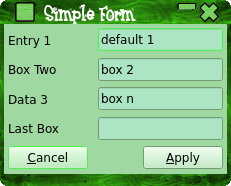

````console

yadqt --type=form -t "Simple Form" -b "Entry 1|Box Two|Data 3|Last Box"  --default="default 1|box 2|box n" --width=300 --height=0
````
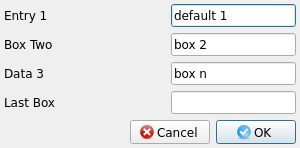

````console

yadqt --type=list -t "Simple List" --default="$(cat /etc/fstab|tr '\\n' '|')" --multiple --btntoerr --width=600 --height=350 2>/dev/pts/2;echo $?
yadqt --type=list -t "Simple List" --default="$(cat /etc/fstab)" --btntoerr --width=600 --height=350 --ipseparator="newline"
yadqt --type=list -t "Simple List" --default="default 1|item 2|item 3|num 4|five|666|item nth" --multiple  --opseparator="newline";echo $?
````
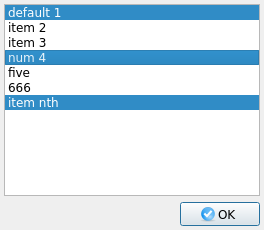

````console

yadqt --type=text -t "Show Text" --default="some text@second line@third line" --ipseparator=@
````
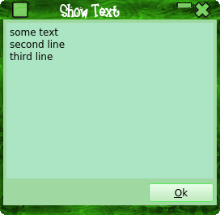

````console

while read;do echo $REPLY;done< <(cat /etc/fstab)|yadqt --type=text --fromstdin --width=800 -t "Show Text"
````
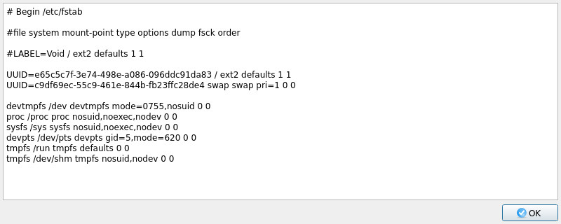

````console

yadqt --type=textfile --width=800 --height=400 -d /usr/include/linux/limits.h  --btntoerr  2>/dev/pts/3;echo $?
````
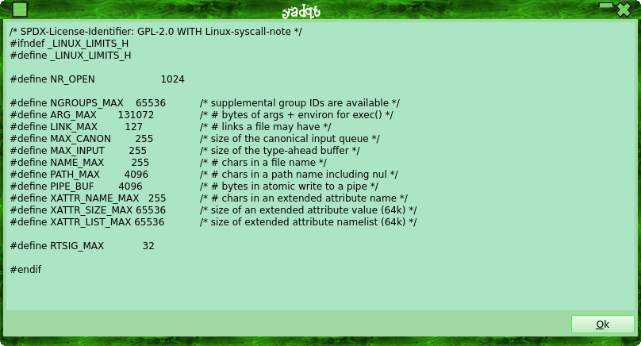

````console

yadqt --type=imagefile -d '/home/keithhedger/WallpapersByCatagory/AllHallows/halloween-graveyard.gif'
yadqt --type=imagefile -d '/home/keithhedger/Backgrounds/bc3.png' --height=420 --width=640
````
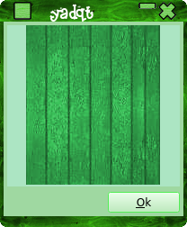

````console

yadqt --type=colour --default="#c080ff80" -t "Select a colour..."|yadqt --type=input -t "Results" -b "Colour Selected" --fromstdin
yadqt --type=colour --default="#c080ff80" --btntoerr -t "Select a colour..."  2>/dev/pts/2;echo $?
````
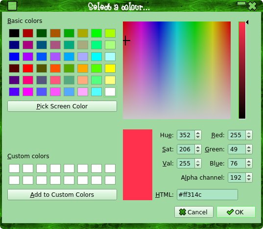

````console

yadqt --type=font -d "Monospace,20"
````
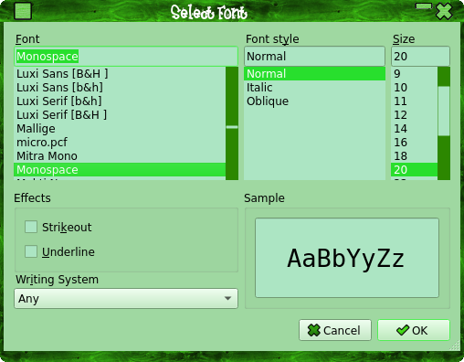

## 
**Tailbox will update additions from file**
````
tail -n25 -f '/run/XfceWMScript.log' |yadqt --type=tailbox -t "Tail box" --width=800
Or
yadqt --type=tailbox -t "Tail box" --width=800 < /run/XfceWMScript.log
````
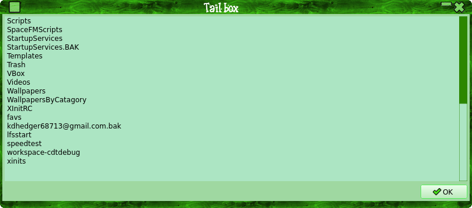

##
**Notepad simple text file editor**
````console
yadqt --type=notepad --width=800 --height=400  ../../README ;echo $?
````
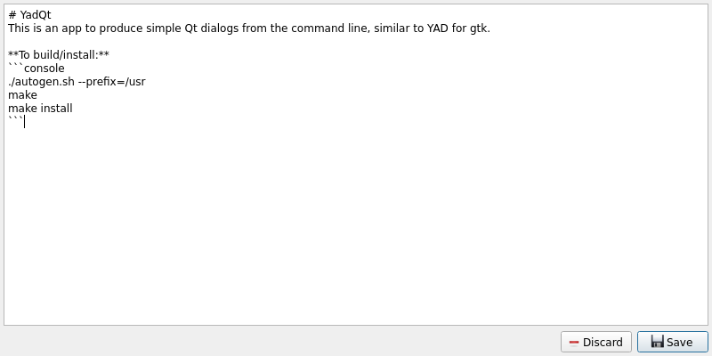  

##
**Richtext simple richtext viewer**
````console
yadqt --type=richtext --width=800 --height=400 '/tmp/KeithDHedger.github.io/docs/index'
````
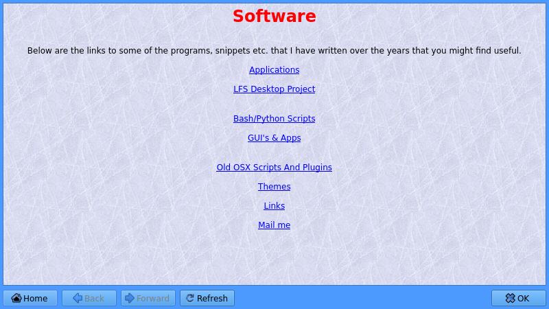

##
**Simple search in current folder:**  

Searches files for text and opens in default app.
````console
find .  -print0 |xargs -0 grep -s --binary-files=without-match --ignore-case --binary-files=without-match --line-number "$(yadqt --type=input -t Search -b "Search for")"|yadqt --type=list -t "Found" --width 800 --fromstdin --ipseparator=newline |awk -F: '{print $1}'|xargs xdg-open
````  

  

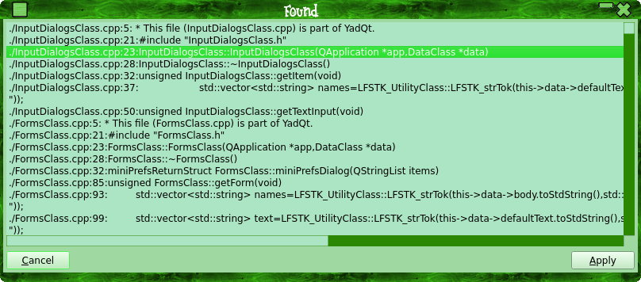  

***
Some options are not yet implemented

### TODO
documentation - ONGOING ... :(  
more boxes  
set o/p separator for data.DONE  
set i/p separator for data.DONE  

