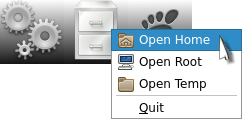
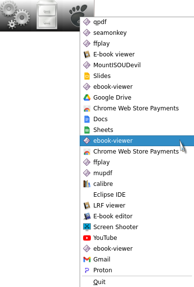
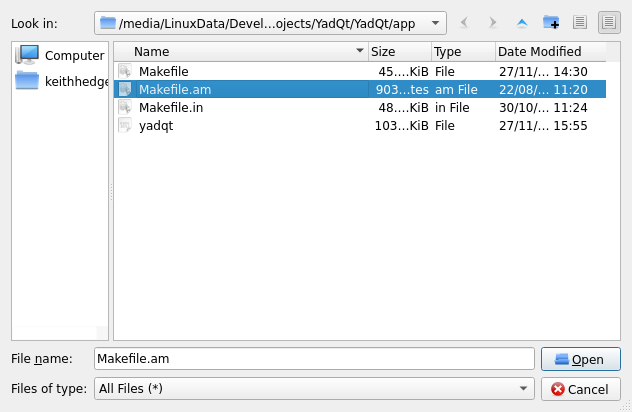
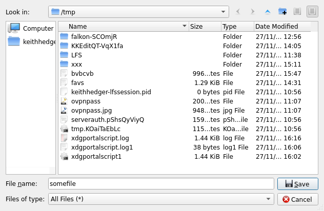
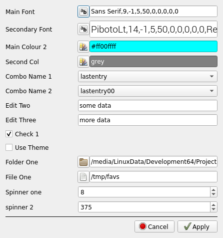
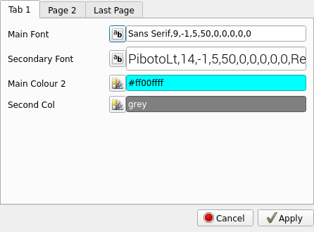
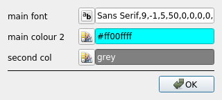

# YadQt
This is an app to produce simple Qt dialogs from the command line, similar to YAD for gtk.

**To build/install:**
```console
./autogen.sh --prefix=/usr
make
make install
```

**QUICK USE:**  
yadqt -h
```console
Usage: YadQt/app/yadqt [options]

Options:
  -h, --help                           Displays help on commandline options.
  --help-all                           Displays help, including generic Qt
                                       options.
  -v, --version                        Displays version information.
  -a, --appname <YadQt>                Application name.
  -t, --title <YadQt>                  Title.
  -b, --body <Information>             Body.
  -d, --default, --data <keithhedger>  Default text ( lists, forms etc, 1st
                                       positional arg passed will overide this
                                       ).
  --fromstdin                          Read default data from stdin.
  --width <0>                          Dialog width ( set to 0 for default size
                                       for dialog ).
  --height <0>                         Dialog height ( set to 0 for default
                                       size for dialog ).
  --opseparator <|>                    Separator for multi item output ( use
                                       "newline" to use '\n' ).
  --ipseparator <|>                    Separator for multi item default text
                                       input ( use "newline" to use '\n' ).
  --multiple                           Select multiple items ( lists ).
  --btntoerr                           Print button to stderr.
  --buttons <Ok>                       Buttons ( for info boxes ).
  --icon <system-run>                  Icon to use for tray menu.
  --type <aboutqt>                     Box Type ( no type will display aboutbox
                                       for Qt )
                                       Types are:
                                       about aboutqt query info warn fatal input
                                       getitem form list textfile imagefile
                                       colour font text tailbox notepad richtext
                                       openfile savefile prefsdialog
                                       tabbedprefsdialog traymenu.
                                       More info and examples here:
                                       https://keithdhedger.github.io/pages/yadq
                                       t/yadqt.html
```` 
### Dialog types:
````console
about  
aboutqt  
query  
info  
warn  
fatal  
input  
getitem  
form  
list  
textfile  
imagefile  
colour  
font  
text  
tailbox  
notepad  
richtext
openfile
savefile
prefsdialog
tabbedprefsdialog
traymenu
````
    
### Examples:
````console
yadqt --type=aboutqt
yadqt --type=about -b "About box with html<br><br><a href=\"https://keithdhedger.github.io\">Website</a><br><br><a href=\"mailto:keithdhedger@gmail.com\">Mail Me</a>"
````

````console

yadqt --type=fatal -t "DANGER!" -b "BSOD!" --buttons="abort|Ignore" --btntoerr 2>/dev/pts/2;echo $?
````


````console

cat /usr/include/linux/limits.h|yadqt --type=getitem -t "Select Item" -b "Items:"  --ipseparator=newline --fromstdin
yadqt --type=getitem -t "my title" -b "some combobox input"  -d "one|three|two|end" --btntoerr 2>/dev/pts/2;echo $?
````


```` console

yadqt --type=input -t "my title" -b "some user input"  -d "default input txt";echo $?
````


````console

yadqt --type=info -b "Some info for you" --buttons="ok" --btntoerr 2>/dev/pts/2;echo $?
````


````console

yadqt --type=form -t "Simple Form" -b "Entry 1|Box Two|Data 3|Last Box" --btntoerr --default="default 1|box 2|box n"  2>/dev/pts/2;echo $?
````


````console

yadqt --type=form -t "Simple Form" -b "Entry 1|Box Two|Data 3|Last Box"  --default="default 1|box 2|box n" --width=300 --height=0
````


````console

yadqt --type=list -t "Simple List" --default="$(cat /etc/fstab|tr '\\n' '|')" --multiple --btntoerr --width=600 --height=350 2>/dev/pts/2;echo $?
yadqt --type=list -t "Simple List" --default="$(cat /etc/fstab)" --btntoerr --width=600 --height=350 --ipseparator="newline"
yadqt --type=list -t "Simple List" --default="default 1|item 2|item 3|num 4|five|666|item nth" --multiple  --opseparator="newline";echo $?
````


````console

yadqt --type=text -t "Show Text" --default="some text@second line@third line" --ipseparator=@
````


````console

while read;do echo $REPLY;done< <(cat /etc/fstab)|yadqt --type=text --fromstdin --width=800 -t "Show Text"
````


````console

yadqt --type=textfile --width=800 --height=400 -d /usr/include/linux/limits.h  --btntoerr  2>/dev/pts/3;echo $?
````


````console

yadqt --type=imagefile -d '/home/keithhedger/WallpapersByCatagory/AllHallows/halloween-graveyard.gif'
yadqt --type=imagefile -d '/home/keithhedger/Backgrounds/bc3.png' --height=420 --width=640
````


````console

yadqt --type=colour --default="#c080ff80" -t "Select a colour..."|yadqt --type=input -t "Results" -b "Colour Selected" --fromstdin
yadqt --type=colour --default="#c080ff80" --btntoerr -t "Select a colour..."  2>/dev/pts/2;echo $?
````


````console

yadqt --type=font -d "Monospace,20"
````


## 
**Tailbox will update additions from file**
````
tail -n25 -f '/run/XfceWMScript.log' |yadqt --type=tailbox -t "Tail box" --width=800
Or
yadqt --type=tailbox -t "Tail box" --width=800 < /run/XfceWMScript.log
````


##
**Notepad simple text file editor**
````console
yadqt --type=notepad --width=800 --height=400  ../../README ;echo $?
````
  

##
**Richtext simple richtext viewer**
````console
yadqt --type=richtext --width=800 --height=400 '/tmp/KeithDHedger.github.io/docs/index'
````


##
**System tray icon examples**
````console
yadqt --type=traymenu --title="Run Apps" --icon=system-run --data="XTerm|xterm|xterm|Open Google|google-chrome|xdg-open https://www.google.com|New Email|mail_new|xdg-email"
YadQt/resources/examples/trayexample.sh
````

####

####


##
**File choosers**
````console
yadqt --type=openfile
yadqt --type=savefile -d /tmp/somefile
````

####


##
**Prefs Dialog:**
````
Prefs will be saved in ~/.config/KDHedger/APPLICATIONNAME.
APPLICATIONNAME will default to YadQt, or set it via the -a switch.
Prefs are standard QT QSettings files.
Prefs are also echoed to stdout When you select 'Apply', format for output is:
PREFSNAME=VALUE
Output seperator is set with --opseparator.
See the examples in /usr/share/YadQt/examples
````

````console
pushd /usr/share/YadQt/examples
	./bashprefs.sh
popd
````

####
````console
pushd /usr/share/YadQt/examples
	./bashprefstabbed.sh
popd
````

####
````console
echo 'font|prefs/main font|Sans Serif,9,-1,5,50,0,0,0,0,0|colour|prefs/main colour 2|#ff00ffff|colour|second col|grey'|yadqt --type=prefsdialog -t "my prefs" -a yadprefsdialog --fromstdin
````
 

**Example prefs config file:** 

````console
#page
#type=page
#tab label
#if using paged prefs first entry MUST be a page
page
Tab 1

#font selector
#type=font
#prefs name, prefs sections seperated by /
#default, will be overwitten when prefs are saved
font
prefs/Main Font
Sans Serif,9,-1,5,50,0,0,0,0,0

font
Secondary Font

#colour selector
#type=colour
#prefs name, prefs sections seperated by /
#default, will be overwitten when prefs are saved
colour
prefs/Main Colour 2
#ff00ffff

#colour selector
#type=colour
#prefs name, prefs sections seperated by /
#default, will be overwitten when prefs are saved
colour
Second Col
grey

#page
#type=page
#tab label
#if using paged prefs first entry MUST be a page
page
Page 2

#combobox
#type=combobox
#prefs name, prefs sections seperated by /
#default entry to select, blank=none
#entry 1
#entry 2
#entry n
#end combobox
combostart
prefs/Combo Name 1

entry1
entry2
e3
lastentry
comboend

#combobox
#type=combobox
#prefs name, prefs sections seperated by /
#default entry to select, blank=none
#entry 1
#entry 2
#entry n
#end combobox
combostart
Combo Name 2
lastentry00
entry1
entry 200
e 30
lastentry00
comboend

#edit box
#type=edit
#prefs name, prefs sections seperated by /
#default, will be overwitten when prefs are saved
edit
prefs/Edit Two
some data

#page
#type=page
#tab label
#if using paged prefs first entry MUST be a page
page
Last Page

#edit box
#type=edit
#prefs name, prefs sections seperated by /
#default, will be overwitten when prefs are saved
edit
Edit Three
more data

#check box
#type=check
#prefs name, prefs sections seperated by /
#default (0/1), will be overwitten when prefs are saved
check
prefs/Check 1
0

#check box
#type=check
#prefs name, prefs sections seperated by /
#default (0/1), will be overwitten when prefs are saved
check
Use Theme
0

#folder select
#type=folder
#prefs name, prefs sections seperated by /
#default, will be overwitten when prefs are saved
folder
Folder One

#file select
#type=file
#prefs name, prefs sections seperated by /
#default, will be overwitten when prefs are saved
file
Fiile One
/usr

#spin box
#type=spinner
#prefs name, prefs sections seperated by /
#minimum
#maximum
#value
#step
#N.B. if step=0 up/down arrows wont work you can only type a value
#for float spinners the number of decimals used are the same as the decimals in the step value
spinner
Spinner one
1
10
5
0.1

#spin box
#type=spinner
#prefs name, prefs sections seperated by /
#minimum
#maximum
#value
#step
#N.B. if step=0 up/down arrows wont work you can only type a value
#for float spinners the number of decimals used are the same as the decimals in the step value
spinner
prefs/spinner 2
200
500
200
25

endpefs
````
***
**Simple search in current folder:**  

Searches files for text and opens in default app.
````console
find .  -print0 |xargs -0 grep -s --binary-files=without-match --ignore-case --binary-files=without-match --line-number "$(yadqt --type=input -t Search -b "Search for")"|yadqt --type=list -t "Found" --width 800 --fromstdin --ipseparator=newline |awk -F: '{print $1}'|xargs xdg-open
````  

  

  

***
Some options are not yet implemented

### TODO
documentation - ONGOING ... :(  
More examples  
more boxes  
set o/p separator for data.DONE  
set i/p separator for data.DONE  


