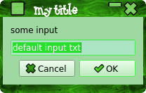

# YadQt
This is an app to produce simple Qt dialogs from the command line, similar to YAD for gtk.<br>

To build/install:
````console
./autogen.sh --prefix=/usr
make
make install
````

QUICK USE:<br>
yadqt -h
```console
Usage: yadqt [options]

Options:
  -h, --help                   Displays help on commandline options.
  --help-all                   Displays help including Qt specific options.
  -v, --version                Displays version information.
  -t, --title <YadQt>          Title.
  -b, --body <Information>     Body.
  -d, --default <keithhedger>  Default text.
  --width <0>                  Dialog width.
  --height <0>                 Dialog height.
  --opseparator <|>            Separator for multi item output ( use "newline"
                               to use '\n' ).
  --multiple                   Select multiple items.
  --btntoerr                   Print button to stderr.
  --buttons <Ok>               Buttons.
  --type <aboutqt>             Box Type.
````
Examples:<br>
yadqt --type=fatal -t "my title" -b "some info"  -d "some info" --buttons="abort" --btntoerr 2>/dev/pts/2;echo $?<br>
<br>

yadqt --type=aboutqt<br>

yadqt --type=getitem -t "my title" -b "some input"  -d "one|three|two|end" --btntoerr 2>/dev/pts/2;echo $?<br>
<br>

yadqt --type=gettext -t "my title" -b "some input"  -d "default input txt";echo $?<br>
<br>

yadqt --type=info -t "my title" -b "some info"  -d "some info" --buttons="abort" --btntoerr 2>/dev/pts/2;echo $?<br>
<br>

yadqt --type=form -t "Simple Form" -b "Entry 1|Box Two|Data 3|Last Box" --btntoerr --default="default 1|box 2|box n"  2>/dev/pts/2;echo $?<br>
<br>

yadqt --type=form -t "Simple Form" -b "Entry 1|Box Two|Data 3|Last Box"  --default="default 1|box 2|box n" --width=300 --height=0<br>
<br>

yadqt --type=list -t "Simple List" --default="$(cat /etc/fstab|tr '\n' '|')" --multiple --btntoerr --width=600 --height=350 2>/dev/pts/2;echo $?<br>
yadqt --type=list -t "Simple List" --default="default 1|item 2|item 3|num 4|five|666|item nth" --multiple  ;echo $?<br>
<br>

yadqt --type=list -t "Simple List" --default="default 1|item 2|item 3|num 4|five|666|item nth" --multiple  --opseparator="newline";echo $?<br>

yadqt --type=textfile --width=800 --height=400 -b /usr/include/linux/limits.h  --btntoerr  2>/dev/pts/3;echo $?<br>
<br>

yadqt --type=imagefile -b '/home/keithhedger/Backgrounds/bc3.png' --height=420 --width=640<br>
<br>
yadqt --type=imagefile -b '/home/keithhedger/WallpapersByCatagory/AllHallows/halloween-graveyard.gif'<br>

yadqt --type=colour --default="#c080ff80" --btntoerr -t "Select a colour..."  2>/dev/pts/2;echo $?<br>
<br>
yadqt --type=colour --default="#c080ff80" -t "Select a colour..."|xargs yadqt --type=gettext -t "Results" -b "Colour Selected"  -d <br>

<br>
Some options are not yet implemented<br>
<br>
TODO<br>
documentation :(<br>
more boxes<br>
set o/p separator for data.DONE<br>
set i/p separator for data.<br>
